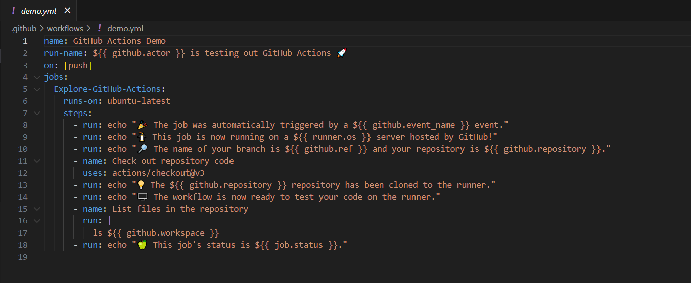
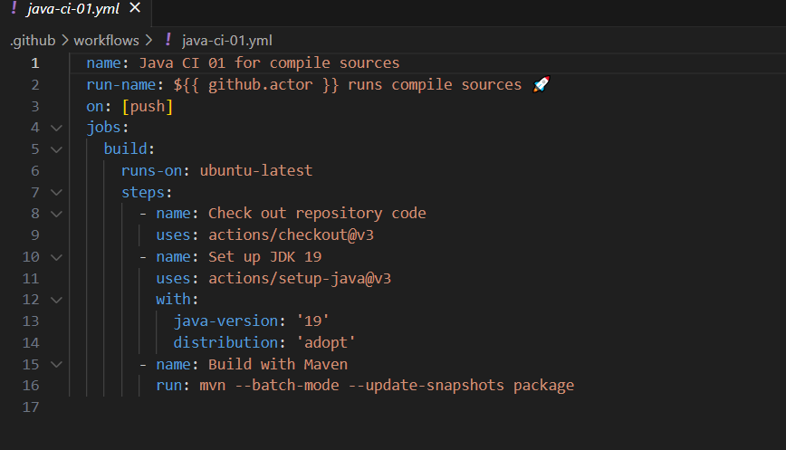
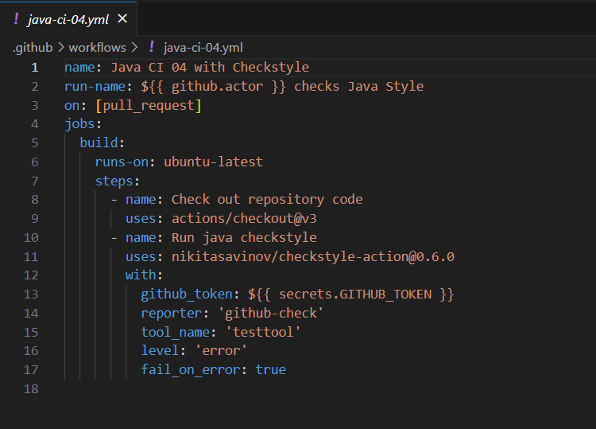
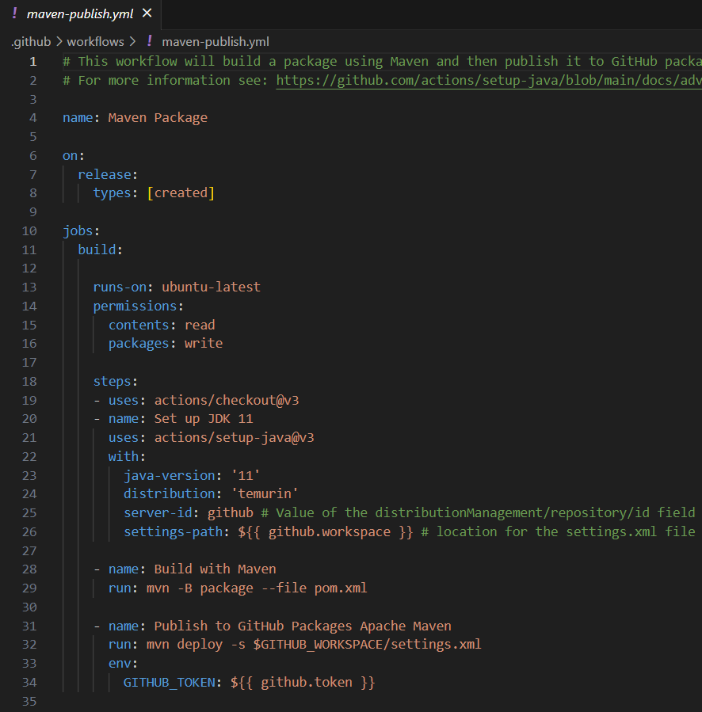
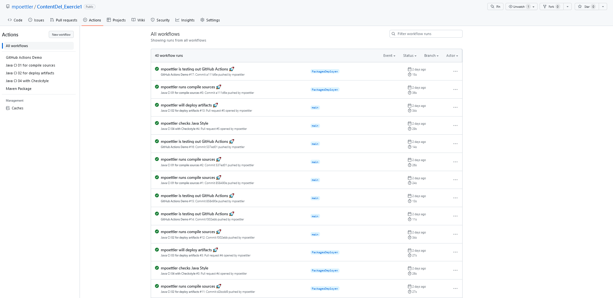

# Calculator Example 1.2 

Upgraded, tested and cleaned for Continuous Delivery Pipeline testing

## Installation

no special installation needed, currently upgraded Tools Version for 1.2
- Maven 3.8.6
- JDK 19.0.1

```bash
mvn clean
```

## Usage

```bash
mvn test
```

## Contributing

Pull requests are welcome. For major changes, please open an issue first
to discuss what you would like to change.

Please make sure to update tests as appropriate.

## License

[GNU GPLv3](https://choosealicense.com/licenses/gpl-3.0/)


# Exerciese 1

Alle Schritte konnten Durchgeführt werden ohne größere vorkomnisse.

Wann können Workflows ausgelöst werden?
Wenn bestimmte Ereignisse im Repo stattfinden wie z.B einen Pull Request

Wann macht es in einem Projekt Sinn einen Workflow auszulösen?
Wenn wiederkehrende Aufgaben automatiesrt werden sollen und zeit spart wie z.B Test oder Kompilieren

Welche Schritte sind für Ihr Projekt automatisierbar?
Testen und das erstellen von Build

Wie sind Workflows grundlegend aufgebaut?
Sind in Schritte unterteilt welche sich nacheinander ausführen

Wozu dienen unterschiedliche Runner (Betriebssysteme) in GitHub Actions?
Damit die Workflows auf allen Betriebssystem ausführbar sind.

Wie können auch unterschiedliche Versionen, zB Java mittels Workflows automatisiert
getestet werden? (Stichwort: Matrix Strategy)
Workflows mit verschiedenen Kombinationen damit auf verschieden Java versionen getestet werden kann.

Demofile welche outputs und checkouts im repo macht

Aktiviert sich wenn ein build maven package gepusht wird



Ausführt bei creates/builds artifacts


pull request und checkt coding style




Screenshots von den Workflows

